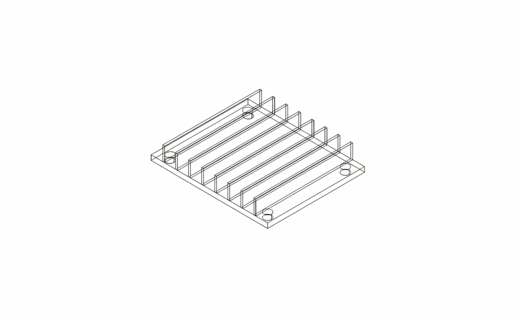

# Mechanical_Parts

Professional Mechanical Parts Collection designed with FreeCAD. Includes parametric models and production-ready technical drawings. | 基于 FreeCAD 设计的专业机械零件集，包含全参数化模型及工程图纸。

---

## 🚀 Featured Project: Python-Automated Industrial Base
This model is generated entirely through **FreeCAD Python API**, demonstrating algorithmic CAD design for manufacturing.

### 🐍 Parametric Logic (Core Code)
Below is the script used to generate this part with automated ribbing and hole patterns:

```python
import FreeCAD as App
import Part

def create_parametric_component(l=100.0, w=100.0, h=5.0, n=6):
    doc = App.newDocument("Automated_Part")
    
    # Create Base Plate
    base = Part.makeBox(l, w, h)
    
    # Algorithmic Ribbing Logic
    ribs = []
    spacing = l / (n + 1)
    for i in range(1, n + 1):
        x_pos = i * spacing
        rib = Part.makeBox(2, w, 15, App.Vector(x_pos - 1, 0, h))
        ribs.append(rib)
    
    # Precision Hole Patterns
    holes = []
    r, pad = 4.0, 10.0
    locs = [(pad, pad), (l-pad, pad), (pad, w-pad), (l-pad, w-pad)]
    for x, y in locs:
        holes.append(Part.makeCylinder(r, h, App.Vector(x, y, 0)))
    
    # Boolean Operations
    final_shape = base.fuse(Part.makeCompound(ribs)).cut(Part.makeCompound(holes))
    Part.show(final_shape)
    doc.recompute()

# Execution with custom parameters
create_parametric_component(120, 100, 5, 8)
```


(Parametric Flange)
import FreeCAD as App
import Part
import math

def create_flange(outer_r=50.0, inner_r=20.0, thickness=10.0, hole_count=6, hole_r=5.0):
    doc = App.newDocument("Industrial_Flange")
    
    # 1. 创建主圆盘
    base = Part.makeCylinder(outer_r, thickness)
    
    # 2. 挖掉中心通孔
    center_hole = Part.makeCylinder(inner_r, thickness)
    flange_body = base.cut(center_hole)
    
    # 3. 算法生成螺栓孔阵列 (Circular Array)
    bolt_holes = []
    pcd = (outer_r + inner_r) / 2  # 孔心距圆周
    for i in range(hole_count):
        angle = math.radians(i * (360.0 / hole_count))
        x = pcd * math.cos(angle)
        y = pcd * math.sin(angle)
        hole = Part.makeCylinder(hole_r, thickness, App.Vector(x, y, 0))
        bolt_holes.append(hole)
        
    # 4. 布尔运算：一次性切除所有孔
    final_shape = flange_body.cut(Part.makeCompound(bolt_holes))
    Part.show(final_shape)
    doc.recompute()

# 调用示例：创建一个 8 孔法兰
create_flange(60, 25, 12, 8, 4)

.png)
